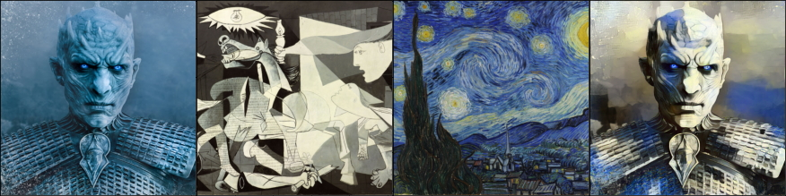
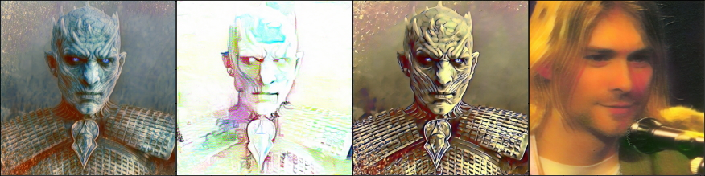
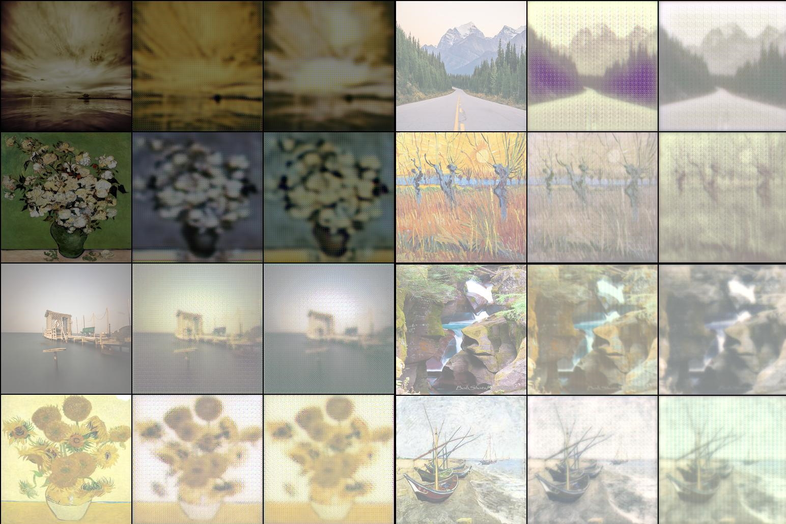
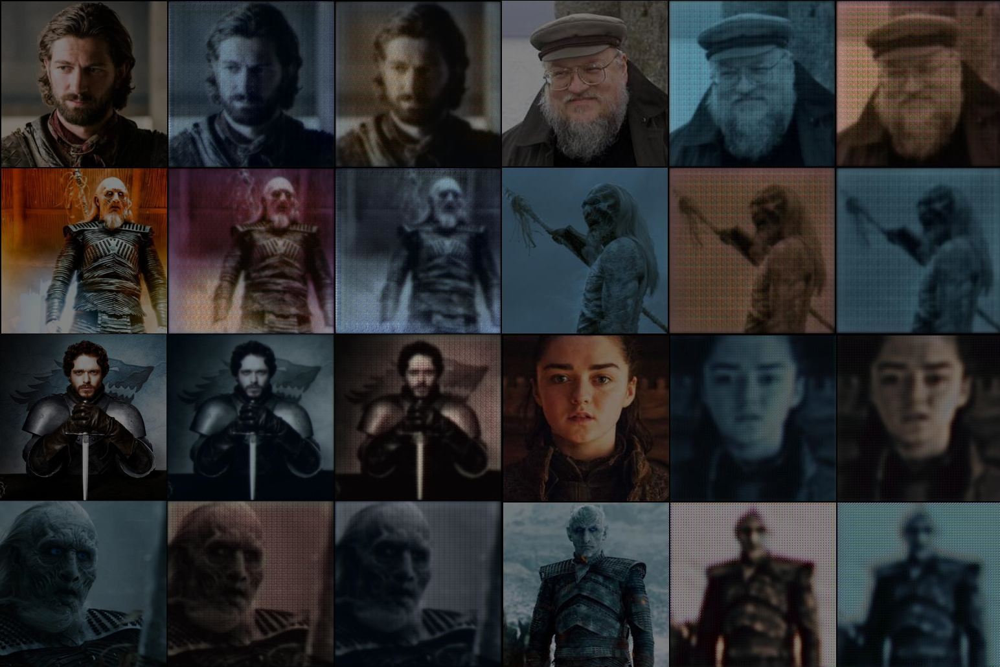

# История о том, как опасно начинать смотеть Игру Престолов (без спойлеров)
Итак, в качестве предисловия - да, весной я посмотрела всю Игру Престолов, и теперь жуткий фанат. Ну всё, тепрь к сетям.
# TwoStylesTransfer
Решила начать с простого, StyleTransfer, два стиля с разными весами. Честно скажу, что сделано на основе ноутбука с лекции, изменения делались исключительно для осуществления двух-стилевой генерации. 
Это пример преобразования Короля Ночи на основе картин Пикассо и Ван Гога:

А это - мои эксерименты с тем же королём ночи, а также Куртняшка Кобейн, или просто Cute Cobain, созданный смешением его фотографии с картинами Айвазовского.

# CycleGAN
Хотя в тексте домашки использование материалов с курса на stepik не возбраняется, но в качестве запасного варианта сделала CycleGAN.
Пару слов о реализации - я пробовала разные модели генераторов, дискриминаторов, разные лоссы и оптимизаторы. Однако представленные в ноутбуке сработали для моих задач лучше всего, так что выбраны они обоснованно, хоть и не стала прописывать все опробованные мной сочетания, чтобы не перегружать ноутбук графиками и сводками.

1. **vangogh2photo**
Реализовала перевод картин Ван Гога в фотографии и обратно. Так как в бесее потока упоминали, что эта часть доашки не проверяется - то код без комментариев, но глянуть можно. Считайте, черновой вариань ноутбука по GAN.

2. **people2whitewalkers**
А вот тут начинается самое интересное: фанатя по Игре Престолов, я решила написать сеть, которая поможет представить, как выглядели бы герои, если бы оказались в противоположном лагере. Вот что, если бы Джона Сноу младенцем забрали белые ходоки? Каким бы он был? Сеть позволит это узнать.

# Если будете пересматривать Игру Престолов
Небольшое замечание по датасету: он не большой, но используется аугментация, так что сеть худо-бедно да учится. Но всем желающим посмотреть/пересмотреть шедевр и помочь проекту, сделав пару скриншотов с ходоками буду очень благодарна. В качестве "людской" части датасета взяты фотографии каста Игры Престолов и некоторых другихлюбимых мной сериалов, ещё бы Ведьмака добавила, но время поджимоало, потом добавлю. Так же можно встретить рандомные лица актеров из интернета и, естественно, фото Джорджа Мартина, автора Игры Престолов.
# Ну и напоследок
Спасибо за внимание, хорошего дня! :)
